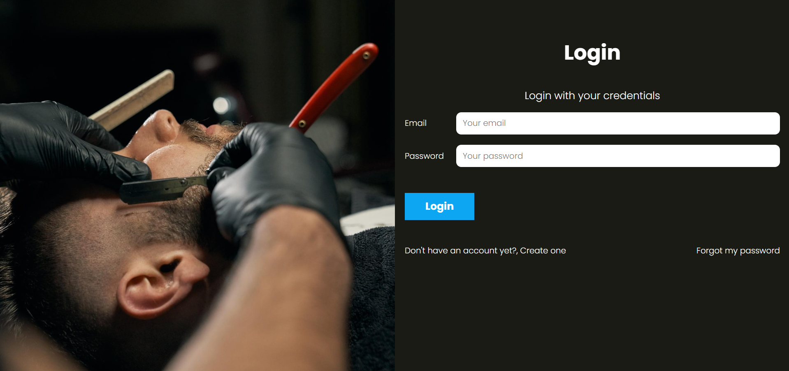
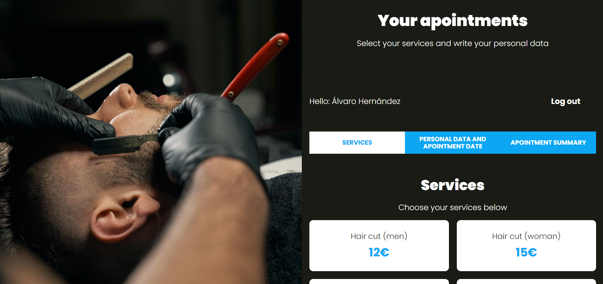

# Hair salon app

A user-friendly web app designed for hair salon appointments. Clients can effortlessly schedule appointments, while salon owners gain access to an admin panel for managing services and reviewing/deleting appointments. Simplify your scheduling process with intuitive interfaces and real-time availability.


## Screenshots
 


## Tech stack

- **Client:** JavaScript & SASS
- **Server:** PHP (With composer), MySQL & Apache
## Run Locally

#### Requirements
You'll need: [PHP](https://www.php.net/downloads.php), [Composer](https://getcomposer.org/), [MySQL](https://dev.mysql.com/downloads/installer/) & [Node.js](https://nodejs.org/en) (for npm) all installed.

Clone the project

```bash
  git clone https://github.com/wisyxx/Hair-Salon-App.git
```

Go to the project directory

```bash
  cd Hair-Salon-App
```

Install dev dependencies

```bash
  npm install -D
```
Please create a .env file in the folder "/includes" with the following variables:

```env
  DB_HOST = your_host
  DB_PASS = your_password
  DB_SCHEMA = your_schema
  DB_USER = your_user
```

Set up composer

```bash
  composer update
```

Run gulp tasks

```bash
  npm start
```

Start the server

```bash
  cd public
  php -S localhost:3000
```
## License

[](https://choosealicense.com/licenses/mit/)

